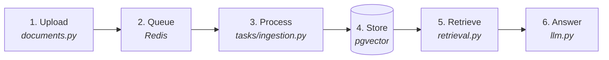

# Start here

There are 19 documents in this repository. This page says which ones you need
and in what order, so you never have to guess.

**Pick the row that describes you.**

| You want to… | Read | Time |
|---|---|---|
| See what it does | [README](README.md#screenshots) | 2 min |
| Run it locally | [Quick start](README.md#quick-start) | 15 min |
| Understand how it works | [The 20-minute tour](#the-20-minute-tour) below | 20 min |
| Change the backend | [`backend/README.md`](backend/README.md) | 10 min |
| Change the frontend | [`frontend/README.md`](frontend/README.md) | 10 min |
| Look up a word | [GLOSSARY](GLOSSARY.md) | as needed |
| Fix something broken | [Troubleshooting](README.md#troubleshooting) | as needed |
| Run the tests | [backend](backend/tests/README.md) · [frontend](frontend/tests/README.md) | 5 min |

Unfamiliar with RAG, embeddings or vector search? Read the
[glossary](GLOSSARY.md) first. Twenty minutes there saves an hour everywhere
else.

---

## The one-paragraph version

You upload documents. DocMinds reads them (OCR if they are scans), splits them
into passages, and converts each passage into a list of numbers capturing its
meaning. When you ask a question, it converts the question the same way, finds
the passages closest in meaning, and asks a language model to answer using only
those — returning the answer with citations pointing at the exact file and page.

That is the whole system. Everything else is detail.

---

## The 20-minute tour

Six stops, in the order the data moves. Follow it once and the codebase stops
being a pile of folders.

### 1. A file arrives — [`api/v1/documents.py`](backend/app/api/v1/documents.py)

The endpoint writes the bytes to disk, inserts a row with `status="pending"`,
enqueues a job, and returns. It does **not** process the document.

*Why it matters:* this is the decision the whole backend is shaped around. A
300-page scan takes minutes, and no HTTP request can wait minutes.

### 2. The job waits — Redis

Only the document **id** crosses the queue, never the file. The worker re-reads
the row, so it always sees current state rather than a snapshot.

### 3. The worker picks it up — [`tasks/ingestion.py`](backend/app/tasks/ingestion.py)

Seven stages: load, verify the file, **extract**, **chunk**, clear old chunks,
save, **embed**. The status column moves `pending → processing → completed`,
which is what the UI polls.

The three bold stages are the interesting ones, and they live in
[`services/`](backend/app/services/README.md) — the folder to read if you read
only one.

### 4. It lands in Postgres — [`models/`](backend/app/models/README.md)

`Organization → Project → Document → Chunk → ChunkEmbedding`.

Memorise that chain. It is the ownership spine of the entire schema, and step 5
walks it in reverse.

### 5. A question comes in — [`services/retrieval.py`](backend/app/services/retrieval.py)

The question is embedded by the **same model** that embedded the chunks, and
Postgres returns the nearest ones — filtered by `org_id` inside the query
itself, so another organisation's chunk is never even a candidate.

*Why it matters:* that filter is the multi-tenant security boundary, and it is a
join rather than an afterthought.

### 6. The model writes an answer — [`services/llm.py`](backend/app/services/llm.py)

The excerpts go into the prompt **numbered**, which is what makes `[1]` in an
answer resolve to a real file and page.

*Why it matters:* citations are not a feature bolted on top. They are the reason
the answer can be checked, and the numbering is the entire mechanism.

**You now understand DocMinds.** Everything else is detail on one of these six
stops.

---

## Every document

### Orientation
| | |
|---|---|
| [`README.md`](README.md) | The full reference — setup, API, config, deployment |
| [`GLOSSARY.md`](GLOSSARY.md) | Every term, explained |
| `START-HERE.md` | This page |

### Backend
| | |
|---|---|
| [`backend/`](backend/README.md) | The API/worker split, and the pipeline |
| [`app/api/`](backend/app/api/README.md) | Dependencies, and who is allowed in |
| [`app/api/v1/`](backend/app/api/v1/README.md) | All 20 endpoints |
| [`app/core/`](backend/app/core/README.md) | Settings, security, Celery |
| [`app/db/`](backend/app/db/README.md) | Sessions, `Base`, migrations |
| [`app/models/`](backend/app/models/README.md) | The 11 tables, with an ER diagram |
| [`app/schemas/`](backend/app/schemas/README.md) | The shapes on the wire |
| [`app/services/`](backend/app/services/README.md) | **The RAG pipeline** |
| [`app/tasks/`](backend/app/tasks/README.md) | Background jobs |
| [`scripts/`](backend/scripts/README.md) | Manual utilities |
| [`tests/`](backend/tests/README.md) | 234 tests, in two tiers |

### Frontend
| | |
|---|---|
| [`frontend/`](frontend/README.md) | The app, and how it talks to the API |
| [`app/`](frontend/app/README.md) | The four routes |
| [`components/`](frontend/components/README.md) | Upload, search, chat |
| [`lib/`](frontend/lib/README.md) | The API client |
| [`tests/`](frontend/tests/README.md) | 106 tests |

---

## Five things that will save you time

**1. A document stuck on "pending" means no worker is running.**
The API and the Celery worker are two processes; starting only `uvicorn` leaves
uploads queued forever. `POST /api/v1/tasks/trigger-add` confirms it in seconds.

**2. Use the Search tab to debug bad answers.**
It runs the same retrieval with no model involved. If the right passage is in
the results, the problem is generation. If it is not, the problem is retrieval.
Two completely different fixes, and this tells you which you have.

**3. Set the three providers to `mock` to run without any API key.**
`OCR_PROVIDER`, `EMBEDDING_PROVIDER` and `LLM_PROVIDER`. Fake output, but
deterministic, and the whole pipeline runs.

**4. Changing `EMBEDDING_PROVIDER` invalidates every stored vector.**
Vectors from different models are not comparable. Nothing stops you, and search
simply starts returning nonsense. Re-embed everything.

**5. Postgres is on 5433, not 5432.**
So it does not collide with one you may already be running.

---

## Honest state of the repository

**340 tests: 234 backend, 106 frontend.** They cover the chunker's token
arithmetic, the retrieval SQL, the multi-tenant isolation, the API's auth
wiring, and the frontend's API client and three panels — see
[`backend/tests/`](backend/tests/README.md) and
[`frontend/tests/`](frontend/tests/README.md).

Each of those files also names what it does *not* cover, which is the more
useful half: PDF and Office extraction, the real OCR engines, document upload
end to end, the four frontend pages (including the document polling), and
anything driving a real browser against a real backend.

**Uploads live on local disk**, so the API and the worker must share a
filesystem. Running them on separate machines needs the storage layer changed
first.

**`config.py` ships a real `SECRET_KEY` as its default**, and it is in this
public repository. Set your own before deploying anything; nothing will warn
you.
