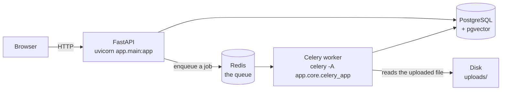
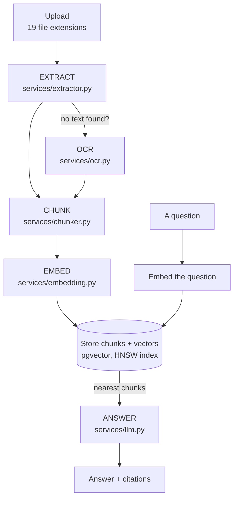

# `backend/` — the DocMinds API and worker

Two processes, one codebase.



**The API** answers requests and returns quickly. **The worker** does the slow
work — reading a 300-page PDF, running OCR, embedding a few hundred chunks.
They share the database and the models, and communicate only through the queue.

That split is the single most important thing about this backend. Uploading a
document returns in milliseconds because the endpoint writes a row, drops a job
on Redis and replies; the actual processing happens somewhere else, minutes
later, and the UI polls for it.

---

## What it does, in one pass

A file goes in; searchable, answerable knowledge comes out.



The left half runs once per document, in the worker. The right half runs on
every question, in the API. They meet at the vector index — which is the whole
point of the design: the expensive work is done once, so a question is cheap.

---

## Layout

| Folder | Holds |
|---|---|
| [`app/api/`](app/api/) | The endpoints, and the dependencies they share |
| [`app/core/`](app/core/) | Settings, security, the Celery app |
| [`app/db/`](app/db/) | The session factory, the declarative base, migrations |
| [`app/models/`](app/models/) | 11 SQLAlchemy tables |
| [`app/schemas/`](app/schemas/) | Pydantic request/response shapes |
| [`app/services/`](app/services/) | **The RAG pipeline.** Six modules, no HTTP |
| [`app/tasks/`](app/tasks/) | The Celery jobs |
| [`scripts/`](scripts/) | One-off tools, run by hand |

`app/main.py` sits above them all: it builds the FastAPI object, mounts the
routers and owns startup and shutdown.

Each folder has its own `README.md`. Every source file already opens with a long
comment explaining itself — the folder docs cover what a single file cannot:
how its neighbours fit together.

---

## The API surface

20 endpoints, all under `/api/v1`.

| Router | Endpoints | For |
|---|---|---|
| `auth.py` | 3 | Signup, login, refresh |
| `users.py` | 1 | The current user |
| `projects.py` | 2 | List and create projects |
| `documents.py` | 3 | Upload, list, preview |
| `search.py` | 1 | Semantic search — chunks, no LLM |
| `chat.py` | 6 | Sessions, messages, feedback — search **plus** an answer |
| `tasks.py` | 3 | Queue diagnostics |

`/docs` gives the interactive OpenAPI explorer once the server is up.

**Search and chat are deliberately separate.** Search returns the raw matching
chunks and nothing else; chat runs the same retrieval and then asks a language
model to write an answer over the results. Keeping them apart means you can see
exactly what the model was given — which is the difference between debugging a
retrieval problem and guessing at one.

---

## Two ideas that shape everything

### 1. `org_id` is the security boundary

This is multi-tenant. Every organisation's documents, chunks, projects and chat
sessions are invisible to every other organisation, and that is enforced in the
queries themselves rather than by a check at the edge.

`retrieval.search()` takes `org_id` as a required argument and filters on it in
SQL. So a vector search cannot return a neighbouring tenant's chunk even if the
embeddings are near-identical — the row is never a candidate.

When adding a query anywhere in this backend, the question to ask first is
*"which organisation is this scoped to?"*

### 2. Every external dependency has a mock

OCR, embeddings and the LLM each support a `mock` provider:

```
OCR_PROVIDER       tesseract | easyocr | paddleocr | mock
EMBEDDING_PROVIDER local | openai | mock
LLM_PROVIDER       groq | mock
```

Set all three to `mock` and the entire pipeline runs end to end with no API
keys, no model downloads and no Tesseract install — producing fake but
**deterministic** output. That is what makes the system demonstrable on a laptop
and testable in CI.

It is also a real design constraint rather than a convenience: it forces each
service to keep its provider logic behind one interface, so swapping OpenAI for
a local model is a setting rather than a rewrite.

---

## Running it

```bash
cd backend
pip install -r requirements.txt

# Postgres (with pgvector) on 5433, Redis on 6379
docker compose up -d

alembic upgrade head          # create tables, enable pgvector, build the index

uvicorn app.main:app --reload                    # terminal 1: the API
celery -A app.core.celery_app worker --loglevel=info   # terminal 2: the worker
#   on Windows add --pool=solo (Windows has no fork())
```

**Both processes are required.** With the API alone, uploads succeed and then
sit on "Queued" forever — which is the single most common setup problem here,
and exactly what the `/tasks/trigger-add` diagnostic exists to diagnose.

Port **5433**, not 5432, so it does not collide with a Postgres you may already
be running.

---

## Root files

| File | Purpose |
|---|---|
| `requirements.txt` | Pinned dependencies |
| `alembic.ini` | Migration config; the URL is filled in by `db/migrations/env.py` |
| `docker-compose.yml` | Postgres + pgvector, and Redis |
| `Dockerfile` | The deployed image |

---

## Known gaps

Worth knowing before trusting a change:

- **PDF and Office extraction are untested**, because they need real binary
  fixtures rather than generated ones. [`tests/`](tests/README.md) has 234
  tests covering the services, the schemas, the retrieval SQL and the HTTP
  layer; that file names the rest of the gaps.
- **Document upload is untested** end to end -- no test posts a real
  multipart file through the seven ingestion stages.
- **Uploads are stored on local disk** (`uploads/`), so the API and the worker
  must share a filesystem. That rules out running them on separate machines
  without changing the storage layer first.
