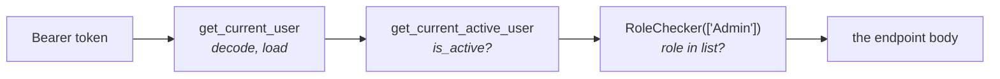

# `app/api/` — the HTTP layer

The edge of the backend. Everything here is about turning a request into a call
on a service and a response back out — and about deciding who is allowed to
make it.

| Path | Holds |
|---|---|
| `deps.py` | The dependencies every endpoint injects |
| [`v1/`](v1/) | The 20 endpoints themselves |

---

## `deps.py` — four dependencies

FastAPI's dependency injection is what keeps authentication out of every
endpoint body. You declare what you need in the signature; FastAPI resolves it
before your code runs.

```python
async def read_documents(
    db: AsyncSession = Depends(deps.get_db),
    current_user: User = Depends(deps.get_current_active_user),
):
```

By the time the first line of that function executes, the token has been
decoded, the user loaded, and their account confirmed active. **If any of that
fails the endpoint body never runs at all** — the dependency raises, and FastAPI
turns it into a response. There is no "did I remember to check?" in an endpoint,
because there is nothing to remember.

| Dependency | Gives you | Fails with |
|---|---|---|
| `get_db` | A session, closed afterwards | — |
| `get_current_user` | The user the token names | 401 |
| `get_current_active_user` | …and confirmed not disabled | 401 / 403 |
| `RoleChecker([...])` | …and holding one of these roles | 401 / 403 / 403 |

They chain, each depending on the one above:



**Use `get_current_active_user`, not `get_current_user`.** The plain one omits
the `is_active` check, so a disabled account would still be served. It exists as
the layer beneath, not as an option.

### `RoleChecker` is a class, and that is the interesting bit

A plain function dependency cannot take arguments of its own — FastAPI supplies
its parameters, so there is nowhere to say *which* roles. A class solves it:
`RoleChecker(["Admin", "Manager"])` builds an instance holding that list, and
`__call__` makes the instance callable, which is all FastAPI requires of a
dependency.

That is the standard Python answer to a parameterised dependency, and worth
recognising because it looks like a function call in the signature while being
an object construction.

Currently used on one endpoint: creating a project.

### 401 versus 403

Kept strictly apart throughout:

- **401 Unauthorized** — "I do not know who you are." No token, a bad signature,
  an expired token, a user who no longer exists. Signing in again may help.
- **403 Forbidden** — "I know exactly who you are, and you may not do this."
  A disabled account, or the wrong role. Signing in again will not help.

Collapsing the two produces a UI that logs people out for permission problems.

---

## `v1/` — why the version is in the path

Every route sits under `/api/v1`. Putting the version in the URL means a
breaking change can ship as `/api/v2` while `/api/v1` keeps serving clients that
have not migrated — including browser tabs someone left open.

The prefix comes from `settings.API_V1_STR`, so it is written once.

---

## Conventions across the endpoints

**Endpoints stay thin.** Authorise, validate, call a service, shape the
response. The reasoning lives in `services/`, which is what lets the same logic
run from a Celery task or a script with no HTTP in sight.

**Ownership checks are written once and shared.** `chat.py` puts its in a
`_get_owned_session` helper that every session endpoint calls, rather than
repeating the same two lines in six places — because a check copy-pasted into
five endpoints is a check that eventually gets forgotten in a sixth.

**A row you do not own is 404, not 403.** Answering "forbidden" would confirm
that a session with that id exists, which is itself information. 404 reveals
nothing. This is the one place the 401/403 distinction below is deliberately
not applied: it is about *existence*, not permission.

**Response shapes come from `schemas/`.** `response_model=DocumentOut` is not
documentation: FastAPI filters the response *through* it, so a field absent from
the schema cannot reach the client even if the ORM object carries it. That is
what keeps `hashed_password` out of every user response by construction.
