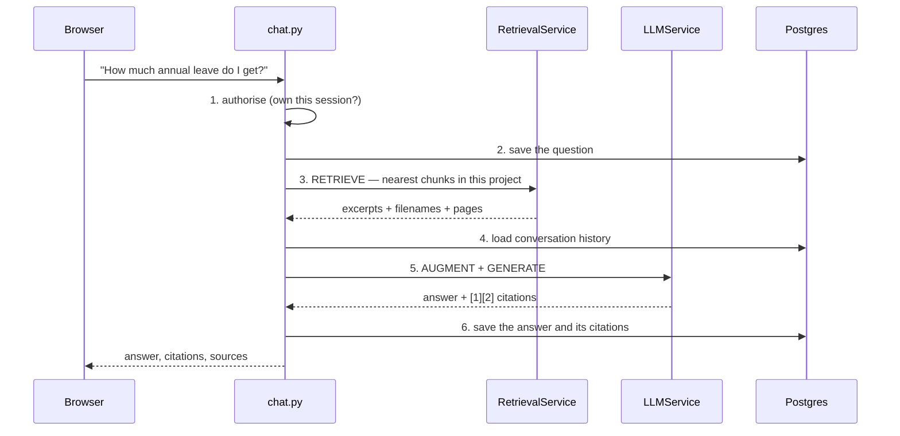

# `app/api/v1/` — the endpoints

20 endpoints across 7 modules, all under `/api/v1`. One module per resource.

Live, interactive documentation is at `/docs` once the server is running,
including a working **Authorize** button — often faster than reading this.

---

## The full list

### `auth.py` — getting a token

| | Route | Does |
|---|---|---|
| `POST` | `/auth/signup` | Register a user, creating or joining an organisation |
| `POST` | `/auth/login` | Email + password → access and refresh tokens |
| `POST` | `/auth/refresh` | Refresh token → a new access token |

Signup branches on which field you send. Pass `org_name` and it creates the
organisation as well as the user, making that user its **Admin** — whoever
creates an organisation administers it. Pass `org_id` and it joins an existing
one instead.

Either way a user cannot exist without an organisation, which is what makes
`org_id` reliable as the security boundary everywhere downstream: there is no
such thing as a user outside a tenant.

### `users.py`

| | Route | Does |
|---|---|---|
| `GET` | `/users/me` | The signed-in user |

One endpoint, and it earns its place: the frontend calls it on load to turn a
stored token back into a session, and it is the cheapest way to check whether a
token is still good.

### `projects.py` — the container for documents

| | Route | Does |
|---|---|---|
| `GET` | `/projects/` | Every project in your organisation |
| `POST` | `/projects/` | Create one — **Admin or Manager only** |

The only place `RoleChecker` is used.

### `documents.py`

| | Route | Does |
|---|---|---|
| `POST` | `/documents/upload` | Save the file, queue the job |
| `GET` | `/documents/` | List, with status |
| `GET` | `/documents/{id}/preview` | The original file back |

Upload takes `multipart/form-data` — `Form(...)` and `File(...)` rather than a
JSON body, because a file cannot be a JSON field.

What it does *not* do is process the document. It writes the bytes to disk,
inserts a row with `status="pending"`, enqueues the Celery job and returns. The
response arrives in milliseconds; the work happens in the worker. That is why
`GET /documents/` exists in the shape it does — the frontend polls it to watch
`pending → processing → completed`.

### `search.py` — retrieval, without an LLM

| | Route | Does |
|---|---|---|
| `POST` | `/search/` | The matching chunks and their scores |

`POST` for a *search* is deliberate. A query, filters and `top_k` do not fit
comfortably in a URL, and a question can be long enough to bump against query
string limits.

This endpoint returns exactly what the retriever found: the chunk text, the
source file, the page, and a similarity score. No model runs. It is the single
most useful debugging tool in the project — when an answer is wrong, this tells
you whether retrieval found the right passage and the model misused it, or
whether the right passage was never retrieved at all. Those have completely
different fixes.

### `chat.py` — retrieval plus an answer

| | Route | Does |
|---|---|---|
| `POST` | `/chat/sessions` | Start a conversation |
| `GET` | `/chat/sessions` | List yours |
| `GET` | `/chat/sessions/{id}/messages` | The transcript |
| `DELETE` | `/chat/sessions/{id}` | Delete a session |
| `POST` | `/chat/sessions/{id}/messages` | **Ask a question** |
| `POST` | `/chat/messages/{id}/feedback` | Rate an answer |

### `tasks.py` — is the queue alive?

| | Route | Does |
|---|---|---|
| `POST` | `/tasks/trigger-add` | Queue a trivial `1 + 2` |
| `POST` | `/tasks/trigger-document` | Queue a no-op document task |
| `GET` | `/tasks/status/{task_id}` | Poll a result |

Diagnostics, not features. Both `POST`s return `202 Accepted` — the correct
code for "I have taken this, it is not done yet".

`trigger-add` is the fastest answer to *"why is my document stuck on pending?"*.
If a trivial addition never completes, no worker is consuming the queue, and
nothing about the document is at fault.

---

## `POST /chat/sessions/{id}/messages` — the endpoint the project exists for

Everything else supports this one. It is worth following end to end.

**Step 2 saves the question before the model is called**, not after. If
generation then fails or times out, the question is still in the transcript —
the user retries rather than retypes, and the record stays accurate.

**Step 3 is scoped twice.** `org_id` from the token, and `project_id` from the
session. The first is the security boundary; the second is why a conversation
in the "HR Handbook" project does not answer from the finance documents.

**Step 4 is what makes follow-ups work.** Without history, "and for part-time
staff?" is a question with no subject. With it, the model can resolve what
"and" refers to.

**Step 5 is the whole of RAG in two words.** *Augment*: paste the retrieved
excerpts into the prompt, numbered. *Generate*: ask the model to answer using
only those excerpts. The grounding is not a setting — it is the prompt.

A session titled "New Chat" is renamed from the first 60 characters of the first
question, so the sidebar reads as something recognisable.

---

## Conventions

**One `router` per module**, mounted with its prefix and tags in `main.py`
(Authentication, Users, Projects, Documents, Tasks, Semantic Search, RAG Chat).
The tags are what group the endpoints into sections on `/docs`.

The two health endpoints are the exception and live in `main.py` itself: `GET /`
and `GET /api/v1/health`. They sit outside a router because they must answer
whether or not the rest of the app is wired up.

**Status codes are chosen, not defaulted.** `201` for something created, `202`
for something queued, `204` for a delete with nothing to say, `404` rather than
`403` for a row you do not own.

**`response_model` on everything that returns data.** FastAPI filters the
response through the schema, so a field the schema does not list cannot escape
even if the ORM object has it.

**The path parameter is typed `uuid.UUID`.** A malformed id is then rejected by
FastAPI with a `422` before any query runs — no handwritten validation, and no
chance of a bad id reaching the database.
