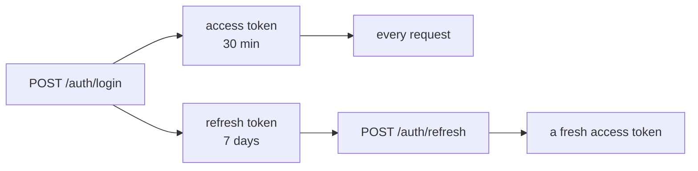

# `app/core/` — the foundation

Three modules that everything else is built on, and that depend on nothing else
in the app. That position is what makes them safe to import from anywhere: an
import of `core` can never create a cycle, because it never points back up.

| File | Owns |
|---|---|
| `config.py` | Every setting, read once from the environment |
| `security.py` | Password hashing, JWT creation and decoding |
| `celery_app.py` | The Celery application the worker runs |

`__init__.py` deliberately re-exports nothing. Importing from the module that
owns the thing means asking for a setting does not also construct the Celery app
and import passlib.

---

## `config.py` — one `Settings` object

Every knob in the system is an attribute on one class, read from the
environment (or `.env`) by pydantic-settings and validated on startup.

```python
from app.core.config import settings
settings.RETRIEVAL_TOP_K     # 5
```

**Wrong values fail at import, not at 3am.** A typo in a `Literal` field —
`EMBEDDING_PROVIDER=lokal` — refuses to start with a message naming the field,
rather than surfacing hours later as an unexplained `AttributeError` deep in the
pipeline.

### The settings that change behaviour most

| Setting | Default | Matters because |
|---|---|---|
| `OCR_PROVIDER` | `tesseract` | `tesseract` \| `easyocr` \| `paddleocr` \| `mock` |
| `EMBEDDING_PROVIDER` | `local` | `local` \| `openai` \| `mock` |
| `LLM_PROVIDER` | `groq` | `groq` \| `mock` |
| `EMBEDDING_DIMENSION` | `384` | **Must match the provider's model** |
| `RETRIEVAL_TOP_K` | `5` | How many chunks the model gets |
| `RETRIEVAL_MIN_SCORE` | `0.15` | Below this, a match is discarded |
| `DEFAULT_CHUNK_SIZE` | `500` | Tokens per chunk |
| `DEFAULT_CHUNK_OVERLAP` | `50` | Tokens repeated across the boundary |
| `LLM_TEMPERATURE` | `0.1` | Low on purpose — see below |
| `POSTGRES_PORT` | `5433` | Not 5432, to avoid a local Postgres |
| `MAX_UPLOAD_SIZE_BYTES` | 50 MB | |

**`LLM_TEMPERATURE = 0.1`** is a design decision, not a default. Temperature is
how much randomness the model is allowed; for creative writing you want it high.
Here the model's job is to restate what the retrieved excerpts say, accurately.
Invention is the failure mode the entire architecture exists to prevent, so the
setting is pushed as close to deterministic as is useful.

**`RETRIEVAL_MIN_SCORE`** is what allows an honest "I don't know". Vector search
always returns *something* — the nearest chunk to an unanswerable question is
still the nearest chunk. Discarding weak matches is what stops the model
answering from unrelated text.

**Set all three providers to `mock`** and the whole system runs with no API
keys, no model downloads and no Tesseract install, producing fake but
deterministic output.

### The default `SECRET_KEY` is a development convenience

There is a real hex string checked into `config.py` as the default. It is in the
public repository, so anyone can forge a token against a deployment that keeps
it. **Set `SECRET_KEY` in the environment before deploying anything.** It is
convenient locally and unsafe anywhere else, and it will not warn you.

---

## `security.py` — passwords and tokens

Two unrelated jobs that share a theme: nothing here trusts the client.

### Passwords

Hashed with **bcrypt** via passlib, never stored or logged in plain text. Bcrypt
is deliberately *slow* — that is the feature. A fast hash lets an attacker with
a stolen database try billions of guesses a second; a slow one makes the same
attack impractical. It also salts every hash automatically, so two users with
the same password get different stored values.

`deprecated="auto"` lets a stronger scheme be added later while old bcrypt
hashes keep verifying, so an upgrade does not lock everyone out.

### Tokens

Two kinds, and the difference is the point.

|  | Access | Refresh |
|---|---|---|
| Lives | 30 minutes | 7 days |
| Carries | user id, role, `org_id` | user id only |
| Used for | every request | getting a new access token |



The short access lifetime limits the damage from a leaked token — 30 minutes,
not a week. The long refresh lifetime is why users are not asked to sign in
every half hour.

**A refresh token carries no role and no `org_id`, on purpose.** Its only job is
to prove identity long enough to mint a new access token; the permissions are
re-read from the database at that moment. A role revoked in the database is
therefore gone at the next refresh rather than lingering in a token for a week.

**Every token carries a `type` claim**, and it is checked. Without it, a refresh
token — the long-lived one — would be accepted as an access token, quietly
turning a 30-minute credential into a 7-day one.

---

## `celery_app.py` — the queue

One `Celery` instance, imported by both processes for different reasons: the API
imports it to *send* jobs, the worker to *run* them.

Redis is used twice, in two distinct roles:

- **Broker** — carries work *to* the worker. This is the queue.
- **Result backend** — carries answers *back*. This is what makes
  `/tasks/status/{task_id}` possible.

They are the same Redis here, but they are not the same job, and larger
deployments often split them.

`imports=("app.tasks",)` and `autodiscover_tasks(["app"])` are both what make
the worker aware of the tasks. A task whose module is never imported is never
registered, and calling it fails with `NotRegistered` — an error that reads as
nonsense when the function is plainly sitting in the source.

```bash
celery -A app.core.celery_app worker --loglevel=info
#   Windows: add --pool=solo, because the prefork pool needs fork()
```
