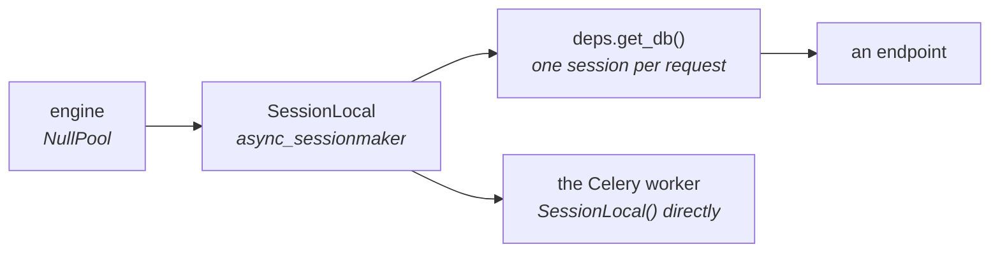

# `app/db/` — the connection, and the schema's history

Three things: how a connection is opened, what every model inherits from, and
how the real database is brought to match the models.

| Path | Job |
|---|---|
| `session.py` | The engine and the session factory |
| `base_class.py` | `Base` — the parent of all 11 models |
| `migrations/` | Alembic: the ordered history of schema changes |

---

## `session.py`



Two ways in. A request gets its session from `get_db` in
[`api/deps.py`](../api/deps.py); anything not serving a request — the worker, a
script — calls `SessionLocal()` itself.

Everything is `async`, via `asyncpg`. An endpoint that waits on the database
yields the event loop instead of blocking it, so one process serves many
requests while each of them waits.

**`get_db` is a generator dependency.** It lives in `api/deps.py` rather than
here, next to the other dependencies an endpoint injects. FastAPI runs it up to
the `yield`, hands the session to the endpoint, and resumes it after the
response is sent:

```python
async with SessionLocal() as session:
    try:
        yield session
    finally:
        await session.close()
```

The `finally` is what matters. The session is released even when the endpoint
raises — without it, a burst of errors would slowly exhaust Postgres's
connection limit and the symptom would appear much later and somewhere else.

### Three settings that are not defaults

**`poolclass=NullPool`.** Normally you want pooling, since opening a connection
is expensive. Here it is disabled deliberately: asyncpg binds a connection to
the event loop that created it, and this codebase runs more than one — the API's
loop, and the fresh loop the Celery worker spins up per task. A pooled
connection created in one loop and handed to another fails in ways that are
confusing to debug. NullPool trades a little speed for that whole class of bug
never happening.

**`expire_on_commit=False`.** By default SQLAlchemy marks every attribute stale
after a commit, so reading one triggers a fresh SELECT — which, under async, is
an implicit lazy load and raises `MissingGreenlet`. Turning it off is what lets
an endpoint commit and then return the row it just wrote.

**`autoflush=False`.** No silent flush before each query. Writes happen where
`flush()` or `commit()` is written, and nowhere else.

---

## `base_class.py`

`Base` does two jobs.

It **registers** every model in `Base.metadata`, which is the catalogue Alembic
diffs against the live database to generate a migration.

And it **derives table names** from class names, so no model has to spell one
out:

```
ChunkEmbedding  →  chunk_embedding  →  chunk_embeddings
User            →  user             →  users
Category        →  category         →  categories
```

The CamelCase split is a regex with two zero-width assertions —
`(?<!^)(?=[A-Z])` — matching the empty position before every capital except the
first. Pluralisation is naive on purpose: `y`→`ies`, already-`s` left alone,
otherwise append `s`. That covers this schema's vocabulary, and anything it
cannot handle sets `__tablename__` explicitly, as `APIKey` does — the rule would
otherwise produce `a_p_i_keys`.

---

## `migrations/` — Alembic

Two revisions, in order:

| Revision | What it does |
|---|---|
| `57f671738b02_initial_migrations.py` | Every table |
| `a1b2c3d4e5f6_rag_vector_index.py` | The `vector` extension, the HNSW index, and a fix |

**The second one is worth reading.** It does more than add an index: it repairs
a real design mistake from the first. `documents.duplicate_hash` was globally
`UNIQUE`, which meant one organisation uploading a common file would
permanently block every other organisation from uploading the same bytes. The
migration drops that index, recreates it non-unique, and adds a `UNIQUE`
constraint on the pair `(project_id, duplicate_hash)` instead.

It also creates the HNSW index:

```sql
CREATE INDEX ... USING hnsw (embedding vector_cosine_ops)
```

Without it, every search is a sequential scan computing the distance to *every*
stored vector. The index is the difference between search that scales and search
that merely works on a demo.

### Running them

```bash
cd backend
alembic upgrade head            # apply everything
alembic revision --autogenerate -m "add a column"
alembic downgrade -1            # undo the last one
```

### Two things about `env.py`

**It uses a *sync* URL** — `settings.SQLALCHEMY_SYNC_DATABASE_URI`, not the
async one the app runs on. Alembic's migration machinery is synchronous, and
handing it an `asyncpg` URL fails in a way that does not obviously say so.

**Its `import app.models` looks unused and is not.** A model class registers
itself in `Base.metadata` only when its module is imported. Without that import
the metadata is empty, so autogenerate concludes every table is unwanted and
writes a migration that **drops them all**. Do not tidy it away.

### Always read a generated migration

Autogenerate diffs two schemas; it does not read intent. A renamed column looks
exactly like one column dropped and another added, and the generated migration
will do precisely that — deleting the data. Replace the pair by hand:

```python
op.alter_column("documents", "old_name", new_column_name="new_name")
```
