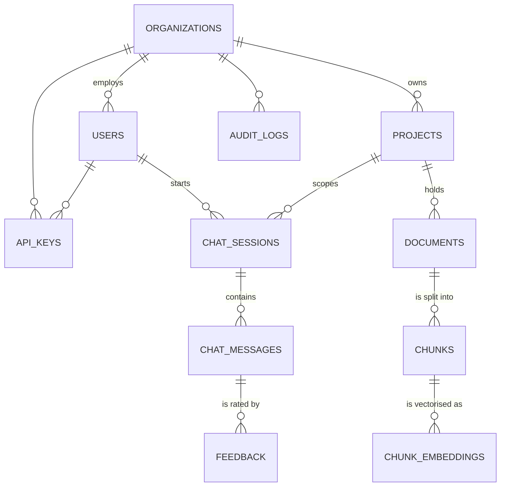
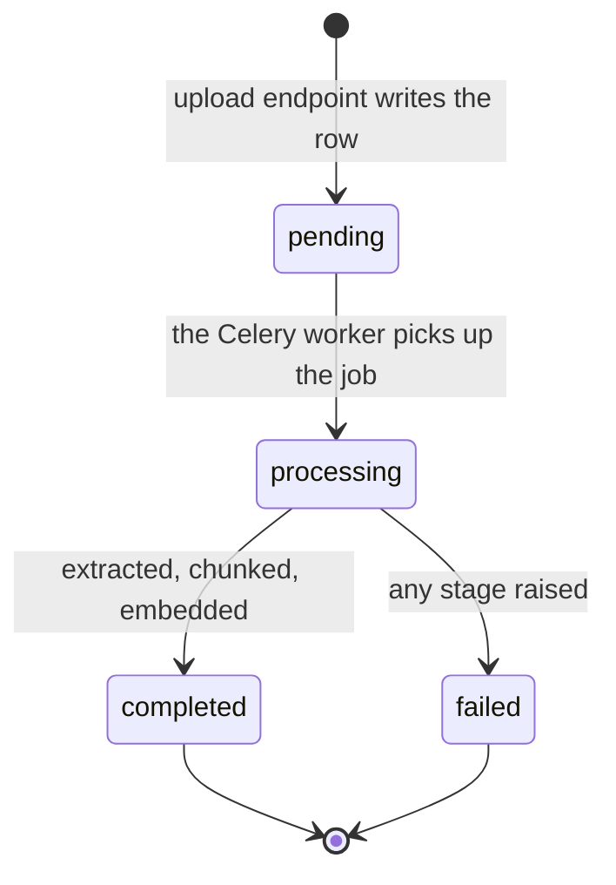

# `app/models/` — the database schema

11 classes across 8 files. Each one is a table; each attribute is a column.
These are the only place in the backend that describes what is actually stored.

Models hold **structure and constraints**, not rules. "A chunk belongs to a
document" lives here. "Only a completed document may be searched" lives in
`services/`.

---

## The shape of the data

Everything hangs off `Organization`. There are two branches: one for content,
one for conversation.



The left spine is the one to memorise:

```
Organization → Project → Document → Chunk → ChunkEmbedding
```

That chain is what `retrieval.search()` walks in reverse to prove a chunk
belongs to the asking organisation. Every link in it is a `NOT NULL` foreign
key, so there is no such thing as an orphan chunk or a project without an owner
— which is what makes the tenant check reliable rather than best-effort.

---

## File index

| File | Classes |
|---|---|
| `organization.py` | `Organization` |
| `user.py` | `User` |
| `project.py` | `Project` |
| `document.py` | `Document` |
| `chunk.py` | `Chunk`, `ChunkEmbedding` |
| `chat.py` | `ChatSession`, `ChatMessage`, `Feedback` |
| `api_key.py` | `APIKey` |
| `audit.py` | `AuditLog` |

---

## Conventions

**UUID primary keys, not integers.** `default=uuid.uuid4`. Sequential integers
leak information in a multi-tenant system — `/documents/41` tells you there are
at least 40 others, and invites guessing at the ones you do not own. UUIDs also
let an id be generated before the row is inserted.

**`ondelete="CASCADE"` almost everywhere.** Deleting a project deletes its
documents, their chunks, and those chunks' embeddings, in one statement handled
by Postgres. Doing it in Python would mean several round trips and a window in
which a half-deleted tree is visible to a concurrent reader.

The exception is `AuditLog.user_id`, which is `SET NULL`: the point of an audit
log is that it survives, so deleting a user must not erase the record of what
they did.

**`meta_data`, not `metadata`.** `metadata` is a reserved attribute on
SQLAlchemy's declarative base — using it shadows the table registry and breaks
the mapper. The underscore is not a style choice.

**Table names derive from class names.** `base_class.py` builds them with a
CamelCase→snake_case regex plus naive pluralisation, so `ChunkEmbedding` becomes
`chunk_embeddings` with nothing written down. `APIKey` opts out with an explicit
`__tablename__ = "api_keys"`, because the rule would otherwise produce the
unreadable `a_p_i_keys`.

**Every model must be imported in `__init__.py`.** A class that is never
imported never registers in `Base.metadata`, and Alembic autogenerate will
silently omit its table — or, worse, generate a migration that drops it. The
apparently-unused imports there are load-bearing.

---

## `Document` — the busiest table

### Its lifecycle

Every row moves through four states, and the UI polls this column:



A document stuck on `pending` means no worker is running — the job is sitting
in Redis with nobody to take it. That is the single most common setup problem
in this project, and this column is where it shows.

Only `completed` documents are searchable. `retrieval.search()` filters on it,
because a document mid-chunking has partial embeddings and would answer from
half a file without saying so.

### Deduplication

`duplicate_hash` is the SHA-256 of the file's **contents**, indexed but
deliberately **not** globally unique. Uniqueness is enforced on the *pair*
`(project_id, duplicate_hash)` by the second migration, which exists partly to
undo exactly this: the initial schema made the hash globally unique.

That pairing is a tenancy decision, not an optimisation. A globally unique
constraint would mean one organisation uploading a common file — a standard
form, a public PDF — would silently block every other organisation from ever
uploading it. Scoping to the project makes "already uploaded" mean *here*.

### `meta_data` (JSONB)

Everything the pipeline learned, in one queryable column: language, word and
page counts, chunk count and strategy, embedding model and dimension, whether
OCR ran, how long processing took, and `error` when the status is `failed`.

JSONB rather than columns because the pipeline gains new measurements over time,
and each would otherwise be a migration. It is Postgres's binary JSON type, so
it stays indexable and queryable — unlike JSON kept in a text column.

---

## `Chunk` and `ChunkEmbedding` — why they are two tables

The obvious design puts the vector on the chunk row. These are split because
the two have genuinely different lifetimes.

Re-embedding a corpus — a new model, a new provider — replaces every vector
while the text is untouched. Keeping them apart makes that a delete-and-insert
on one table rather than an update across the table holding all the content.
`ChunkEmbedding.model_name` records which model produced each vector, so a
half-migrated corpus is at least diagnosable.

`Chunk` carries `chunk_index` (position document-wide) and `page_number` (for
the citation). Both matter, and they are not the same number: `chunk_index`
counts continuously across pages while `page_number` restarts.

The `embedding` column has a **fixed width** matching `EMBEDDING_DIMENSION`
(384 by default). Inserting a vector of a different length fails outright —
which is a feature, since a silent mismatch would corrupt search rather than
break it.

---

## `chat.py` — three tables for one conversation

`ChatSession` → `ChatMessage` → `Feedback`.

A session is scoped to both a **user** and a **project**, so a conversation is
answered from one project's documents rather than everything the organisation
owns. `Feedback` hangs off an individual message rather than the session,
because "that specific answer was wrong" is the useful signal — and the one
that can be traced back to the chunks that produced it.

---

## Where the real constraints live

Some rules exist only in migrations, not in these files:

| Rule | Where |
|---|---|
| Unique `(project_id, duplicate_hash)` | `a1b2c3d4e5f6_rag_vector_index.py` |
| The HNSW index on `chunk_embeddings.embedding` | `a1b2c3d4e5f6_rag_vector_index.py` |
| The `vector` extension itself | the same migration |

So reading only this folder gives you the schema but not the whole truth. The
HNSW index in particular is what makes vector search fast rather than a
sequential scan of every embedding — and nothing in `chunk.py` mentions it.
