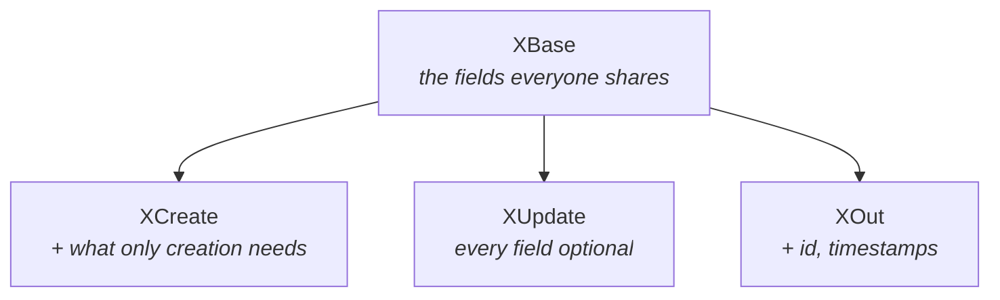

# `app/schemas/` — the shapes on the wire

Pydantic models describing what a request may contain and what a response will
contain. Six files, and none of them touch the database.

**Schemas are not models.** A `models/` class describes a table. A schema here
describes JSON. They differ deliberately and in both directions: `User` has a
`hashed_password` column that no schema exposes, and `SearchResult` has a
`score` field that no table stores.

| File | Covers |
|---|---|
| `user.py` | `UserBase`, `UserCreate`, `UserUpdate`, `UserOut` |
| `token.py` | `Token`, `TokenPayload`, `TokenRefreshRequest` |
| `organization.py` | Base / Create / Update / Out |
| `project.py` | Base / Create / Update / Out |
| `document.py` | `DocumentBase`, `DocumentOut` |
| `rag.py` | Search and chat — 10 classes |

---

## Why they earn their place

### They validate before your code runs

```python
async def create_project(payload: ProjectCreate, ...):
```

By the time the first line executes, the body has been parsed, the required
fields confirmed present, the types coerced and the constraints checked. A bad
request never reaches the function — FastAPI answers `422` with a message naming
the offending field, and no handwritten validation exists anywhere.

### They stop data escaping

This is the part that matters most:

```python
@router.get("/me", response_model=UserOut)
```

`response_model` is not documentation. FastAPI passes the response **through**
the schema, so a field the schema does not declare cannot reach the client even
if the ORM object carries it. `UserOut` has no password field of any kind, which
means leaking a hash is not something anyone has to remember to avoid — it is
structurally impossible.

That is why returning a raw dict "just this once" is a bad habit here. It
bypasses the filter.

---

## The Base / Create / Update / Out pattern

Four schemas per resource, because the four situations genuinely differ:



Taking `User` as the example:

| Schema | Has | Why |
|---|---|---|
| `UserBase` | email, full name, role | Shared |
| `UserCreate` | + `password`, `org_name`/`org_id` | Only supplied at signup |
| `UserUpdate` | everything optional | A PATCH sends one field |
| `UserOut` | + id, `org_id`, flags, timestamps | Server-generated; **no password** |

Inheriting from a common base means a field added to `UserBase` appears in all
of them at once, and cannot drift between the request and response shapes.

`UserUpdate` breaks the inheritance and lists its fields as optional directly,
since "every field is optional" is not something a base of required fields can
express.

---

## `model_config = ConfigDict(from_attributes=True)`

On every `*Out`. It lets Pydantic build a schema straight from a SQLAlchemy row
by reading its attributes, rather than requiring a dict:

```python
return user              # not {"id": user.id, "email": user.email, ...}
```

Without it, every endpoint would copy each field across by hand — tedious, and
exactly the kind of code where a field quietly gets forgotten.

---

## `rag.py` — the RAG contract

The richest file, and the one that defines what search and chat actually
exchange.

| Schema | Direction |
|---|---|
| `SearchRequest` / `SearchResult` / `SearchResponse` | Semantic search |
| `ChatSessionCreate` / `ChatSessionOut` | Conversations |
| `ChatRequest` / `ChatResponse` / `ChatMessageOut` | Asking |
| `Citation` | Where an answer came from |
| `FeedbackCreate` | Rating an answer |

**`Citation` is the schema to understand.** It carries the filename, the page
and the chunk that a numbered `[1]` in an answer refers to, which is what lets
the UI show a source the reader can click and check.

That is the difference between an answer and an assertion — and it is why the
page number is threaded all the way from `extractor.py`'s `--- PAGE BREAK ---`
marker, through the chunker, into `Chunk.page_number`, out of retrieval, into
the numbered prompt, and finally into this schema. Six components cooperate to
make one clickable citation possible.

`Field(...)` constraints on `SearchRequest` — bounds on `top_k`, a minimum
query length — mean a nonsensical search is rejected at the edge rather than
producing a strange but successful-looking empty result.
