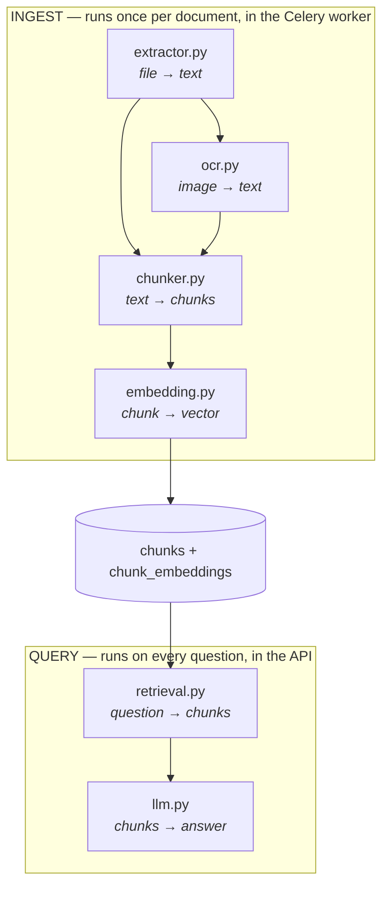

# `app/services/` — the RAG pipeline

Six modules. This is where DocMinds actually does its work; everything else in
the backend exists to feed these or to hand their output back to a browser.

Nothing here imports FastAPI, and nothing returns an HTTP response. A service
takes plain arguments and returns plain data, which is what lets the same
function be called from an endpoint, from a Celery task, or from a script.

---

## The two paths

The six modules are not a stack — they are two chains that meet at the database.



Ingest is slow and rare. Query is fast and constant. Splitting the cost that
way is the entire reason retrieval-augmented generation is practical: a
300-page PDF is read, parsed and embedded once, and every question afterwards
is one indexed vector lookup.

`embedding.py` is the only module both paths touch — and that is not incidental,
it is a correctness requirement. See "One model, both ends" below.

---

## File index

| Module | Class | Job |
|---|---|---|
| `extractor.py` | `DocumentExtractor` | 19 file extensions → text + page markers |
| `ocr.py` | `OCRService` | Pixels → text, when a document has none |
| `chunker.py` | `ChunkerService` | One long text → many citable pieces |
| `embedding.py` | `EmbeddingService` | Text → a list of numbers |
| `retrieval.py` | `RetrievalService` | A question → the nearest chunks |
| `llm.py` | `LLMService` | Chunks + question → a written answer |

---

## `extractor.py` — every format becomes one shape

Ten parsers behind a single `extract(file_path, file_type)` dispatch, each
returning the same `ExtractionResult`. PDF, images (6 extensions), DOCX, PPTX,
XLSX/XLS, HTML/HTM, EML, TXT/MD, CSV, ZIP.

Everything downstream sees text and nothing else. The chunker has no idea
whether it is splitting a spreadsheet or an email, and that is what keeps it
under 430 lines instead of carrying ten special cases.

**The page-break marker is load-bearing.** Pages are joined with a literal
`--- PAGE BREAK ---`, and the chunker splits on exactly that string. It is
the mechanism by which a citation can say *page 12* — a plain concatenation
would lose the page number irrecoverably at the very first step.

`extract_zip` is the recursive one: it unpacks the archive and calls `extract`
again on each member, which is why that method lowercases `file_type` a second
time even though the upload endpoint already did.

---

## `ocr.py` — the fallback, not the default

Only reached when a document yields no usable text. A born-digital PDF already
contains its characters; running OCR on it would be slower *and* less accurate
than simply reading them.

Three real engines and a mock:

| Provider | Trade |
|---|---|
| `tesseract` | Fast, needs a system binary installed |
| `easyocr` | Better on messy scans, downloads model weights |
| `paddleocr` | Strongest on dense layouts, heaviest dependency |
| `mock` | Instant, fake, deterministic |

The provider is a setting, and every one implements the same
`_ocr_*(image_bytes) -> str` shape, so `ocr_image` never branches on more than
which private method to call.

---

## `chunker.py` — the module worth reading first

The least obvious and most consequential decision in the whole pipeline.

**Why chunk at all?** One vector cannot represent a 300-page handbook. Averaged
across everything the document says, it is close to nothing in particular, and a
search would return either the entire book or no useful passage from it. Chunks
are what make the answer specific.

**Why tokens and not characters?** Sizes are counted with `tiktoken`
(`cl100k_base`), because tokens are the unit the language model's context window
is actually measured in. A 500-*character* limit is meaningless to a model; a
500-*token* limit is a budget you can add up.

**Pages first, then chunks.** `chunk_document` splits on the page marker before
any strategy runs, and passes the page number down. `chunk_index` keeps counting
across pages, so it stays unique document-wide while `page_number` restarts —
two different questions ("where in the document?" and "which page do I cite?")
kept as two different numbers.

Three strategies:

| Strategy | Splits on | Good for |
|---|---|---|
| `fixed_size` | A token budget | The default. Anything |
| `sentence` | Sentence boundaries, packed to the budget | Prose that shouldn't be cut mid-thought |
| `markdown` | Headers | Structured docs |

`markdown` is the deliberate exception: it works on the whole document rather
than page by page, because a section under one header can legitimately run
across a page break, and splitting first would tear it in half.

**Overlap** repeats the last ~50 tokens of each chunk at the start of the next.
Without it, a fact that straddles a boundary is in neither chunk in full, and
so matches neither well. The cost is storing that text twice, which is cheap.

---

## `embedding.py` — one model, both ends

Turns text into a fixed-length list of floats positioned so that similar
meanings land near each other. That geometry is the whole trick: "How much
annual leave do I get?" and "Employees accrue 1.75 days of paid leave per month"
share no keywords at all, and sit close together anyway.

| Provider | Model | Dimensions |
|---|---|---|
| `local` | `all-MiniLM-L6-v2` | 384 |
| `openai` | `text-embedding-3-small` | 1536 |
| `mock` | — | 384 |

`EMBEDDING_DIMENSION` must match the provider. The database column is declared
with a fixed width, so a mismatch fails at insert with *"expected N dimensions,
not M"*.

**The constraint that catches everyone:** the question at query time must be
embedded by the *same model* that embedded the chunks at upload time. Vectors
from two different models are not comparable — the numbers do not describe the
same space, so the distances are arithmetic performed on unrelated quantities.

Which means **changing the embedding provider invalidates every stored vector.**
Existing documents must be re-embedded; nothing in the code will stop you, and
search will simply start returning nonsense.

Batching matters here: `get_embeddings(texts)` embeds a whole list in one call,
because per-item calls to a model — local or remote — waste most of the time on
overhead rather than work.

---

## `retrieval.py` — the search, and the security boundary

One `search()` and one `build_history()`. `search` is where multi-tenancy is
enforced, so it is worth reading in full.

```mermaid
sequenceDiagram
    participant A as API
    participant E as EmbeddingService
    participant P as Postgres (pgvector)
    A->>E: embed the question
    E-->>A: [0.12, -0.44, ...]
    A->>P: nearest chunks WHERE Project.org_id = :org
    P-->>A: top_k rows, closest first
    A->>A: similarity = 1 - distance; drop below min_score
```

**The tenant filter is a join, not a check.** The query walks the ownership
chain — chunk → document → project — and filters on `Project.org_id`:

```python
.join(Document, Chunk.document_id == Document.id)
.join(Project, Document.project_id == Project.id)
.where(Project.org_id == org_id)     # >>> the security filter <<<
```

Because it is part of the query, another organisation's chunk is never a
*candidate*, no matter how similar its embedding. That is a materially stronger
guarantee than filtering results afterwards, where forgetting one line leaks
data instead of merely returning too much.

`org_id` is a required positional argument for the same reason. There is no
default and no way to omit it.

**Three more things that query does deliberately:**

- **`Document.status == "completed"`.** A document still being chunked has
  partial embeddings, and would answer from half a file without saying so.
- **`min_score`.** Nearest-neighbour search always returns *something*; the
  closest chunk to a question the corpus cannot answer is still returned, and
  is still irrelevant. Discarding weak matches is what lets the system say
  "I don't know" rather than confabulate from unrelated text.
- **`top_k if top_k is not None else default`**, not `top_k or default` — `0`
  is falsy, and a caller who deliberately passed it deserves to get it.

Similarity is reported as `1.0 - cosine_distance`, so `0.83` means what a reader
expects it to mean.

---

## `llm.py` — writing the answer, with citations

Given the retrieved chunks, produce prose a person can read. Groq
(`llama-3.3-70b-versatile`) or `mock`.

`build_context_prompt` numbers every excerpt and labels it with its source:

```
EXCERPT [1] (source: handbook.pdf, page 12):
Employees accrue 1.75 days of paid leave per month...

QUESTION: How much annual leave do I get?
```

**The numbering is the citation mechanism.** The model writes `[1]` in its
answer, and the frontend maps that number back to the exact file and page, so
the user can check the claim against the source. Citations are not decoration
here — they are the difference between an answer and an assertion.

When retrieval found nothing, the prompt says `EXCERPTS: (none found)`
explicitly rather than shipping an empty block. An empty context leaves the
model free to answer from its training data, which is exactly the hallucination
the whole architecture exists to prevent.

`stream_answer` is the same call token by token, so the UI can start rendering
before the model has finished thinking.

---

## Conventions across all six

**Classmethods over instances.** None of these services hold per-request state,
so there is nothing for an instance to carry. `EmbeddingService.get_embedding(text)`
reads as what it is — a function grouped with its relatives.

**Heavy models load once, lazily.** `_load_local_model` caches the
sentence-transformers model in a module-level global under double-checked
locking, so the first embedding pays the ~10s load and every later one does
not, and two worker threads racing on a cold start cannot load it twice. The
`import sentence_transformers` sits *inside* that function rather than at the
top of the file, which means a deployment configured for `openai` or `mock`
never pays to import PyTorch at all.

**Every external dependency has a `mock`.** Set `OCR_PROVIDER`,
`EMBEDDING_PROVIDER` and `LLM_PROVIDER` to `mock` and the full pipeline runs
with no API keys and no model downloads, producing fake but *deterministic*
output. Deterministic is the important word: it is what would make these
services testable.

And they are used for exactly that. The chunker's token arithmetic, the
retrieval SQL and the tenant isolation above are covered by
[`backend/tests/`](../../tests/README.md) -- 234 tests, of which the four in
`TestTenantIsolation` were verified to fail when the `org_id` filter is
removed.

Still uncovered here: PDF and Office extraction (they need real binary
fixtures), and the OCR engines beyond the mock path.
