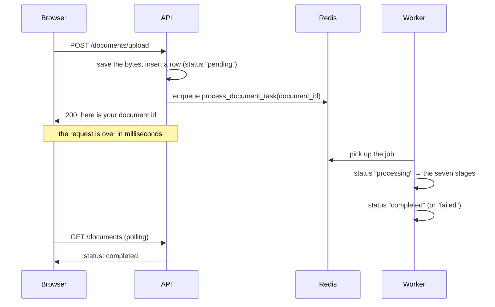

# `app/tasks/` — the background work

What runs in the Celery worker rather than in a web request.

| File | Holds |
|---|---|
| `ingestion.py` | `process_document_task` — the real one |
| `test.py` | `add_numbers_task`, `dummy_process_document_task` — diagnostics |
| `__init__.py` | Imports both, so the worker registers them |

---

## Why any of this exists

Processing a 300-page scanned PDF means parsing it, running OCR on every page,
splitting it into hundreds of chunks and embedding each one. That is minutes of
work. An HTTP request cannot wait minutes — the browser gives up, the proxy
gives up, and the user has no idea whether it worked.

So the upload endpoint does the small part and hands off the large part:



**Only the id crosses the queue.** Not the file, not the text — a message
carrying a 40 MB PDF would be slow to serialise and could exceed the broker's
message limit outright. The worker re-reads the row and the file itself, which
also means it always sees the current state rather than a snapshot from
whenever the job was queued.

The consequence is that the API and the worker must share a filesystem, since
uploads live on local disk under `backend/uploads/`.

---

## `ingestion.py` — the seven stages

`process_document_task` is a thin synchronous wrapper (Celery does not run
`async` functions) around `async_process_document`, which does the work.

| Stage | Does | Fails how |
|---|---|---|
| 0 | Load the document row | Missing → return quietly |
| 1 | Check the file is still on disk | `FileNotFoundError` |
| 2 | **Extract** text, OCR if needed | Unsupported type |
| 3 | **Chunk** the text | — |
| 4 | Delete any previous chunks | — |
| 5 | Insert the chunk rows | — |
| 6 | **Embed** every chunk | Provider errors |
| 7 | Record metrics on `meta_data` | — |

Everything from stage 1 onward runs inside one `try`, whose `except` writes
`status = "failed"` and the error message into `meta_data["error"]`. That is
what lets the UI show *why* a document failed instead of just that it did.

**Three details worth knowing:**

**Stage 0 commits `"processing"` immediately** rather than at the end. Without
that early commit the row would read `"pending"` for the entire run, and a user
watching the UI could not tell a job in progress from a job nobody picked up.

**Stage 4 is what makes re-processing safe.** Deleting existing chunks before
inserting new ones means running the task twice produces one set of chunks, not
two. Celery redelivers a message whose worker died mid-job, so this is not a
hypothetical — an ingestion task must be safe to run again, and stage 4 is the
line that makes it so.

**Stage 0 returning quietly on a missing document is deliberate.** The document
can be deleted between the upload and the worker reaching the job. Raising there
would mark the task failed and retry it forever against a row that no longer
exists.

---

## `test.py` — the diagnostics

`add_numbers_task(x, y)` adds two numbers. That is the entire point: it has no
dependencies, touches no database and reads no file, so if it comes back, the
broker, the worker and the result backend are all working. If it does not, the
problem is the plumbing rather than anything in the pipeline.

The `/api/v1/tasks/*` endpoints expose it, which makes "is a worker running?" a
question you can answer from the browser in a few seconds — against the usual
alternative of staring at a document stuck on `"pending"` and guessing.

---

## Conventions

**Every task is named explicitly:**

```python
@celery_app.task(name="app.tasks.ingestion.process_document_task")
```

Celery otherwise derives the name from the import path it happened to be
registered under. If the API and the worker import it differently — one as
`app.tasks.ingestion`, the other as `tasks.ingestion` — the API enqueues a name
the worker never registered, and the job sits in the queue unclaimed with no
error anywhere. Pinning the name removes that failure mode.

**`__init__.py` imports both modules.** A task registers when its module is
imported; one that is never imported is never registered, and calling it then
fails with `NotRegistered` — a genuinely misleading error, since the function
is plainly sitting right there in the source. `core/celery_app.py` sets
`imports=("app.tasks",)`, which is what pulls this file in, and these explicit
imports are what pull the rest in behind it.

**The worker opens its own database session.** The request's session is long
gone by the time the job runs, so `async_process_document` opens
`SessionLocal()` itself.

---

## Running the worker

```bash
cd backend
celery -A app.core.celery_app worker --loglevel=info
#   Windows: add --pool=solo
```

`--pool=solo` is required on Windows because Celery's default prefork pool
needs `fork()`, which Windows does not have. Solo runs one task at a time in
the main process — fine for development, not for throughput.

**Without a worker running, nothing here executes.** Uploads still succeed,
because the endpoint's job is only to enqueue; the documents simply stay
`"pending"` forever. That is the most common confusion in this project, and
`/api/v1/tasks/trigger-add` is the fastest way to confirm it.
