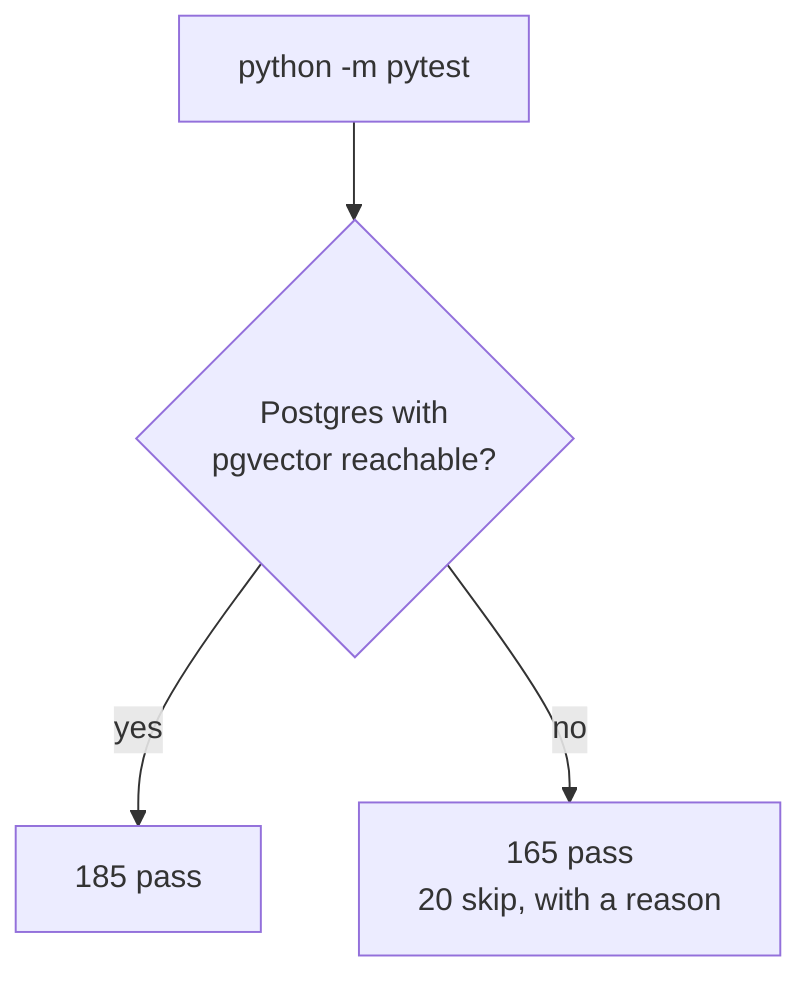

# `backend/tests/` — the test suite

**185 tests.** 165 run anywhere; 20 need a real database and skip cleanly
without one.

```bash
cd backend
python -m pytest                      # everything
SKIP_DB_TESTS=1 python -m pytest      # Tier 1 only
python -m pytest tests/test_chunker.py -v
```

---

## Two tiers, and why



| Tier | Needs | Covers |
|---|---|---|
| **1** | Nothing | Chunking, hashing, tokens, prompts, schemas, extraction |
| **2** | Postgres + pgvector | Retrieval, tenant isolation, cascades |

**Tier 2 skips rather than fails.** Someone with no Docker running should see
`20 skipped`, not twenty red failures they cannot act on. Red must mean
*broken*, not *you have not started a container* — a suite that is red for
environmental reasons is a suite people learn to ignore.

The skip reason distinguishes the two things that can be wrong:

```
Tier 2: cannot reach Postgres at localhost:5433 (ConnectionRefusedError)
Tier 2: connected, but the pgvector extension is not installed (run: alembic upgrade head)
```

### Why not SQLite for Tier 2?

The usual trick for making database tests cheap does not work here. The query
under test uses the `vector` column type and pgvector's `<=>` distance
operator, plus JSONB and the HNSW index.

A SQLite run would not be a faster version of these tests. It would be a
**different** test, passing while the real query is broken — which is worse
than having no test, because it looks like coverage.

---

## The files

| File | Tests | Covers |
|---|---|---|
| `test_chunker.py` | 36 | Token maths, overlap, page-awareness, three strategies |
| `test_extractor.py` | 26 | Dispatch across 19 extensions; text, CSV, HTML, email, ZIP |
| `test_security.py` | 21 | Bcrypt, JWT signing, expiry, the `type` claim |
| `test_llm_prompt.py` | 22 | Excerpt numbering, source attribution, the empty case |
| `test_embedding.py` | 20 | Dimensions, batch order, determinism |
| `test_schemas.py` | 40 | Validation bounds, secret exclusion, table names |
| `test_retrieval_db.py` | 20 | **Tier 2** — search, tenant isolation, cascades |
| `conftest.py` | — | The database probe and shared fixtures |

---

## What is tested, and what is not

These tests target the places where **a bug does not announce itself**. That
is the selection principle throughout: code that crashes when it breaks
largely reports its own bugs; code that returns confident, plausible, wrong
output does not.

Worth reading for what they pin down:

**`test_retrieval_db.py::TestTenantIsolation`** — the most important four
tests here. A bug in the `org_id` filter does not produce an error or a wrong
answer; it produces one company reading another company's documents, with
results that look entirely normal. One test gives two organisations the
*identical* text, so the vectors are indistinguishable and only ownership
separates them.

**`test_chunker.py`** — a lost overlap or an off-by-one page number raises
nothing. Search quality quietly degrades and citations start pointing a page
or two off.

**`test_embedding.py::TestDeterminism`** — the mock provider is not a stub to
be tolerated, it is load-bearing test infrastructure. If its determinism broke,
the Tier 2 tests would not fail cleanly; they would go flaky.

**`test_llm_prompt.py::TestNoChunks`** — that the prompt says "none found"
rather than shipping an empty context block, which would leave the model free
to answer from training data.

**`test_schemas.py::TestUserOutExposesNoSecrets`** — checked by field-name
pattern rather than against a fixed list, so a future `password_reset_token`
fails here instead of shipping.

### Not covered

Honest gaps, so nobody assumes more than is here:

- **PDF, DOCX, PPTX, XLSX extraction.** These need real binary fixtures; a
  generated one mostly tests the library that generated it.
- **The API endpoints.** No HTTP-level tests, so status codes, the auth
  dependencies and `RoleChecker` are unverified from the outside.
- **The ingestion task end to end.** The seven stages are tested individually
  through their services, but not as one run.
- **OCR.** Only the mock path is reachable without installing an engine.
- **The frontend.** No tests at all.

---

## Conventions

**A test name is a sentence.** `test_a_wrong_password_does_not_verify`, not
`test_verify_2`. A failure should be legible from the name alone in CI output.

**Docstrings say why, not what.** The assertion already says what. The
docstring exists for the next person deciding whether a failure is a real bug
or an outdated test.

**Tier 2 cleans up after itself.** The `db` fixture deletes the organisations
a test created, and everything below cascades — which incidentally means every
Tier 2 run re-checks that the `ondelete="CASCADE"` declarations are real.

**Names are unique per test.** Tier 2 shares one database and tests may run in
any order, so a hard-coded `"Test Org"` becomes a unique-constraint failure the
moment two tests use it.

**SQL logging is silenced** in `conftest.py`. The engine runs with `echo=True`
in development, and a single failure otherwise scrolls away under hundreds of
lines of INSERT logging.

---

## Adding a test

1. Tier 1 if it can be. It runs everywhere and it runs fast.
2. Needs a database? Put it in a Tier 2 file with the module-level
   `pytestmark` skip, and clean up what you create.
3. Say **why** in the docstring — particularly what would go wrong in
   production if this behaviour regressed.

### Confirm it can actually fail

The most valuable thing you can do with a new test takes thirty seconds: break
the code it covers, watch the test go red, then restore it. A test that passes
against broken code is worse than no test, and this is the only way to know
which kind you have written.

That check is how the tenant-isolation tests here were validated — commenting
out `.where(Project.org_id == org_id)` turned three of the four red, and the
fourth is the positive case that should still pass.
