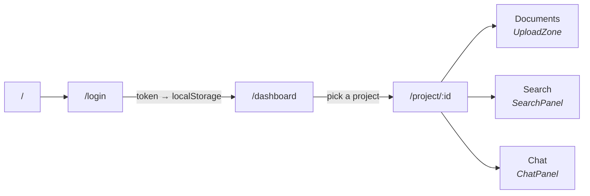

# `frontend/` — the DocMinds web app

Next.js 16 and React 19, with the app router, TypeScript and Tailwind. Around
2,700 lines across four pages, three components and one API client.

It is a **client of the API and nothing more.** No database access, no
retrieval, no model calls — every one of those lives in `backend/`. If the API
is down, this app shows errors; it does not degrade into doing the work itself.

---

## Layout

```
app/                  routes — the folder name IS the URL
  page.tsx            /            the landing page
  login/page.tsx      /login       sign in and sign up
  dashboard/page.tsx  /dashboard   your projects
  project/[id]/       /project/:id documents, search and chat
  layout.tsx          the shell wrapped around every page
  globals.css         Tailwind, and the theme

components/           the three pieces the project page is built from
  UploadZone.tsx      drag and drop, and the upload
  SearchPanel.tsx     retrieval only, with scores
  ChatPanel.tsx       questions, answers and citations

lib/api.ts            every call to the backend, in one file
```

**The app router maps folders to URLs.** `app/project/[id]/page.tsx` serves
`/project/anything`, and the square brackets mark the variable part — no route
table exists anywhere, because the directory tree is the route table.

---

## How the screens connect



The project page is where everything happens; the three tabs are three views of
the same project's documents. Search and chat are separate tabs for the same
reason they are separate endpoints — search shows you exactly what was
retrieved, which is how you tell a retrieval problem from a generation one.

---

## `lib/api.ts` — one door to the backend

No component calls `fetch` directly. Almost every request goes through one
`apiFetch` helper — the two exceptions are `login` and `uploadDocuments`, which
send form encodings rather than JSON and are explained in
[`lib/README.md`](lib/README.md). Having one door is what makes these
behaviours consistent instead of almost-consistent:

**The token is attached automatically** — but only when there is one, so login
and signup do not send `Bearer null`.

**A 401 clears the token and redirects to `/login`.** Handled once, centrally.
The alternative is a screen that silently fails to load anything while the user
wonders what they did wrong.

**FastAPI's `{"detail": ...}` is unwrapped into a real message.** It arrives as
a string for most errors and as an *array* of problems for validation failures,
and `apiFetch` handles both — so the user sees "Project not found" rather than
"Request failed (404)".

**`204 No Content` returns `{}`** rather than calling `.json()` on an empty
body, which would throw.

`getErrorMessage(error)` narrows the `unknown` that TypeScript gives every
`catch` block — JavaScript lets you throw any value at all, so assuming it is an
`Error` is a real bug waiting for an unusual failure.

### The token lives in `localStorage`

Read through `getToken()`, which checks for `window` first. Next.js renders
components on the server, where `localStorage` does not exist and touching it
crashes the render — so the guard is not defensive, it is required.

---

## `"use client"` is on almost everything

Next.js renders on the server by default. Anything using `useState`,
`useEffect`, an event handler or `localStorage` needs the directive at the top
of the file, and every interactive page and component here has it.

Even the landing page, which would otherwise be the one good candidate for
server rendering: it uses Framer Motion and reads `localStorage`, and both are
browser-only. The cost is real — server components render faster and are better
for search engines — so the directive is worth treating as a decision each time
rather than something to paste at the top of every new file.

---

## Polling, and stopping

The project page watches documents move from `pending` through `processing` to
`completed`, because ingestion happens in a Celery worker and finishes whenever
it finishes.

```typescript
const stillWorking = documents.some(
  (d) => d.status === "pending" || d.status === "processing"
);
if (!stillWorking) return;              // stop — nothing left to watch

const timer = setInterval(loadDocuments, 3000);
return () => clearInterval(timer);      // cleanup
```

Two lines here carry real weight. The **early return** means an idle project
makes no requests at all, rather than polling forever at three-second intervals
for a change that will never come. The **cleanup function** clears the interval
when the effect re-runs or the component unmounts; without it every re-render
stacks another timer, and the app quietly escalates into hammering the server.

That cleanup is the single most commonly forgotten line in React, and its
symptom — gradually increasing load with no obvious cause — is a genuinely
unpleasant thing to debug.

---

## Running it

```bash
cd frontend
npm install
npm run dev          # http://localhost:3000
```

The backend must be running at `http://localhost:8000`, or set:

```bash
NEXT_PUBLIC_API_URL=http://your-backend
```

**`NEXT_PUBLIC_` is required**, not stylistic. Next.js only exposes variables
with that prefix to browser code; without it the value is `undefined` at
runtime, and the app falls back to localhost with no error to explain why.

There is **no dev proxy**. The browser calls the backend directly, so the
backend's CORS allow-list has to include `http://localhost:3000` — a CORS error
in the console means the backend, not this app, needs the change.

---

## Tests

```bash
npm test              # watch
npm run test:run      # once
```

122 tests, Vitest with Testing Library — no backend and no network needed. They
cover `lib/api.ts`, the three panels, and this page's polling; see
[`tests/README.md`](tests/README.md) for what is and is not covered, and for
the mutation checks each key assertion was verified against.

Both polling lines quoted above are pinned: removing the `clearInterval`
cleanup fails two tests, and removing the early return fails four.

`/login`, `/dashboard` and the landing page remain untested.

---

## Conventions

**Every fetch has three states.** Loading, error and success are separate pieces
of state and separate renders. A screen that shows nothing while it waits is
indistinguishable from one that is broken.

**Errors are shown, not logged.** `getErrorMessage` exists so the string in
`catch` is the string on screen.

**Tailwind classes are written out in full.** Tailwind scans source text and
generates only the classes it literally finds, so a class assembled at
runtime — `` `text-${color}-500` `` — is purged from the build and silently does
nothing.
