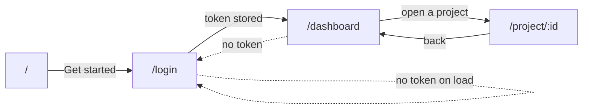

# `frontend/app/` — the routes

Next.js's app router: **the folder structure is the routing table.** A
`page.tsx` inside a folder becomes the page at that URL, and nothing anywhere
lists the routes, because the directory tree already does.

| Path | URL | Lines |
|---|---|---|
| `page.tsx` | `/` | 348 |
| `login/page.tsx` | `/login` | 222 |
| `dashboard/page.tsx` | `/dashboard` | 334 |
| `project/[id]/page.tsx` | `/project/:id` | 376 |
| `layout.tsx` | wraps all of them | 57 |
| `globals.css` | Tailwind and the theme | |

`[id]` in square brackets is a **dynamic segment**: the folder matches any
value, and the page receives it as `params.id`.

---

## The journey

The dotted arrows are the guard. Every protected page checks for a token in a
`useEffect` and calls `router.push("/login")` if there is none.

**That guard is a convenience, not a security control.** It runs in the browser,
where anyone can skip it. What actually protects the data is the backend
rejecting a request with no valid token — this only saves the user from a
screen full of errors. Never treat a client-side redirect as authorisation.

---

## `layout.tsx` — the shell

Wraps every page. It loads the Geist fonts, sets `<body className="antialiased">`,
and exports a `metadata` object that Next.js turns into `<head>` tags at build
time — the title and description a browser tab and a search engine read.

Anything that should appear on every page belongs here and nowhere else.

---

## `page.tsx` — the landing page

Marketing: what DocMinds does, and a way in. It uses Framer Motion and reads
`localStorage`, which is why it carries `"use client"` despite being the one
page that would otherwise benefit most from server rendering.

---

## `login/page.tsx`

One page, two modes — sign in and sign up — toggled by state rather than split
across two routes, because the form is nearly identical and the user switches
between them constantly.

Signing up asks for an **organisation name**, which is not incidental: it
creates the organisation as well as the user, and makes that user its Admin.
Every user belongs to a tenant, and this is where a tenant comes into being.

On success the token is stored and the user is sent to `/dashboard`.

---

## `dashboard/page.tsx`

Lists the organisation's projects and creates new ones. A project is the
container documents live in and the unit chat is scoped to, so it is the first
thing anyone needs.

It also checks `/health` and shows whether the AI providers are configured,
which turns "chat gives strange answers" into something visible *before* you
ask a question rather than after.

Creating a project requires the **Admin or Manager** role. The backend enforces
it; the UI should reflect it, or the button becomes a promise the API breaks.

---

## `project/[id]/page.tsx` — where the work happens

The most substantial page. Three tabs over one project:

| Tab | Component |
|---|---|
| Documents | `UploadZone`, plus the list and its statuses |
| Search | `SearchPanel` |
| Chat | `ChatPanel` |

Tabs are local state, so switching does not refetch or lose what you typed.

**This page owns the polling.** Documents move `pending → processing →
completed` in a Celery worker, on the worker's schedule, so the page asks every
three seconds — and *stops asking* as soon as nothing is pending. See the
polling section in [`../README.md`](../README.md); both the early return and the
`clearInterval` cleanup are load-bearing.

`params.id` arrives as a string from the URL and is passed straight to the API.
It is validated where it can be validated — server-side, by FastAPI's
`uuid.UUID` path type, which rejects a malformed id with a `422` before any
query runs.

---

## Conventions

**`"use client"` on every page here.** All four are interactive.

**Auth guard first, in a `useEffect`.** Check the token, redirect if absent.

**Loading, error and success are three separate states.** A page that renders
nothing while it waits looks exactly like a page that is broken.

**Errors come from `getErrorMessage`** and are shown on screen, not logged to a
console the user will never open.
