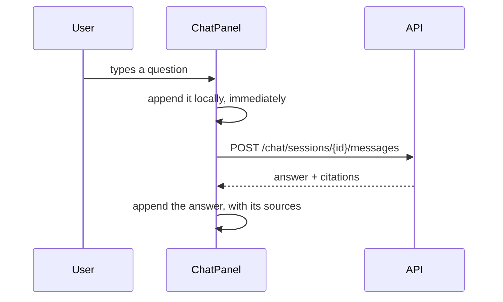

# `frontend/components/` — the three panels

The pieces the project page is built from. Each owns one tab, fetches its own
data, and takes a `projectId` prop — so the page composes them without knowing
how any of them works.

| Component | Tab | Lines |
|---|---|---|
| `UploadZone.tsx` | Documents | 213 |
| `SearchPanel.tsx` | Search | 219 |
| `ChatPanel.tsx` | Chat | 454 |

All three are `"use client"`: state, event handlers and browser APIs
throughout.

---

## `UploadZone.tsx` — drag and drop

Accepts files by drop or by picker, and posts them to
`POST /documents/upload`.

**Both `onDragOver` and `onDrop` must call `preventDefault()`**, and this is the
part everyone gets wrong. A browser's default behaviour for a dropped file is to
*navigate to it* — leaving your app entirely and displaying the PDF. Worse,
without `preventDefault` on `onDragOver` the browser never fires `onDrop` at
all, so a drop zone missing that one line simply does nothing, with no error to
explain it.

```typescript
const handleDragOver = (e) => { e.preventDefault(); ... };  // enables onDrop
const handleDrop     = (e) => { e.preventDefault(); ... };  // stops navigation
```

`ACCEPTED` lists the extensions the backend's extractor supports, and feeds the
file picker's filter. It is a *hint*, not a check — a filter is trivially
bypassed, and the real validation is server-side.

Several files go in one request, appended under the same `files` field name.

After uploading, the page's polling takes over: the documents appear as
`pending` and change on their own.

---

## `SearchPanel.tsx` — retrieval, visible

Calls `POST /search/` and shows what came back: the passage, its source file,
its page, and a similarity score.

**No model runs here, and that is the entire value.** When a chat answer is
wrong there are two possible causes with completely different fixes:

| What search shows | The problem is | Fix by |
|---|---|---|
| The right passage is in the results | Generation — the model misread it | Prompt, temperature, model |
| It is not there at all | Retrieval | Chunk size, `top_k`, `min_score`, re-embedding |

Guessing between those without this panel is slow. That is why search is a tab
in the product rather than a debugging endpoint hidden from users — the
transparency is the feature.

Scores are shown as percentages, so a weak match looks weak.

---

## `ChatPanel.tsx` — questions, answers, and sources

The largest component, and the one the whole project builds towards.



**The question is appended locally before the response arrives.** A model can
take several seconds; a chat that shows nothing until it finishes feels broken.
The optimistic append is what makes the wait legible — the user sees their own
message and a pending answer beneath it.

It is a placeholder with a `temp-` id, and it is handled in both directions.
On success it is swapped for the real saved message from the server. On failure
it is **removed again**, so the transcript never shows a question that was never
answered. An optimistic update without that rollback is the usual version of
this pattern, and it quietly lies to the user the first time a request fails.

While a request is in flight both the input and the send button are disabled —
otherwise a double-click asks the same question twice, and the resulting
transcript is hard to explain afterwards.

### Citations are the point

Each answer carries a list of sources, rendered as collapsible cards:

```
[2] handbook.pdf · page 12          83% match
    "Employees accrue 1.75 days of paid leave per month..."
```

The `[2]` matches the bracketed marker in the answer text, so a claim can be
traced to the passage that supports it. **That is the difference between an
answer and an assertion**, and it is why the page number is carried the whole
way from the extractor's `--- PAGE BREAK ---` marker through the chunker,
retrieval and the numbered prompt to arrive here.

Cards are collapsed by default and expanded per message — tracked in a `Set` of
message ids, because "which of these are open" is exactly a set membership
question, and a `Set` says so more clearly than an array searched with
`.includes()`.

A message with no citations means retrieval found nothing above
`RETRIEVAL_MIN_SCORE`, and the answer will say it does not know. That is the
system working, not failing.

---

## Conventions

**Each component owns its own data.** It fetches what it needs and holds its own
loading and error state. The page passes a `projectId` and nothing else.

**Everything goes through `lib/api.ts`.** No `fetch` in this folder.

**Empty states say what to do.** "No documents yet — upload one to get started"
rather than a blank panel that reads as a bug.
