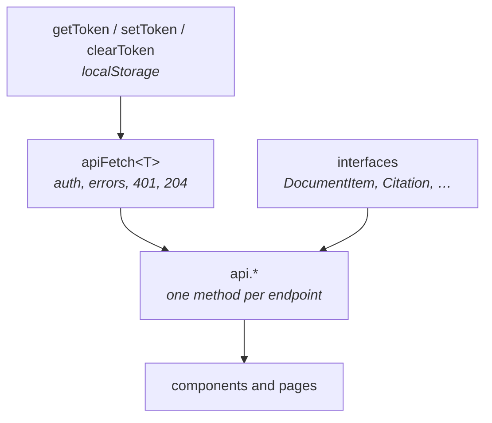

# `frontend/lib/` — the backend, as TypeScript

One file, `api.ts`. Everything the app knows about the API is in it: the URL,
the token, the request helper, the types, and one method per endpoint.

**No component imports `fetch`.** They import `api`. That is the rule the file
exists to make possible — and it is what lets session expiry, error unwrapping
and auth headers be written once instead of in fifteen components with two of
them subtly different.

---

## What is in it



| Piece | Job |
|---|---|
| `API_BASE`, `API_V1` | Where the backend is |
| `getToken` / `setToken` / `clearToken` | The token, in `localStorage` |
| `apiFetch<T>` | The one request helper |
| `getErrorMessage` | An `unknown` from `catch` → a readable string |
| 9 interfaces | The response shapes |
| `api.*` | 15 methods |

---

## `apiFetch<T>` — four behaviours worth knowing

**It attaches the token, when there is one.** The `if (token)` guard is not
tidiness: without it, login and signup would send `Authorization: Bearer null`.

**A 401 clears the token and redirects to `/login`.** Once, centrally. This is
the behaviour that most repays being in one place — the alternative is a screen
that quietly fails to load anything, leaving the user with no idea their session
expired.

**It unwraps FastAPI's error shape, in both forms.** `{"detail": ...}` is a
string for most errors and an *array* of problems for a `422`:

```typescript
message = typeof body.detail === "string"
  ? body.detail
  : body.detail[0]?.msg || message;
```

Handling only the string case is the common bug, and it turns every validation
error into a bare status code precisely when the user most needs to be told
which field is wrong.

**A `204` returns `{}`.** Calling `.json()` on an empty body throws, so deleting
a chat session would fail *after* succeeding.

---

## The two methods that bypass it, and why

`apiFetch` sets `Content-Type: application/json`. Two endpoints do not take
JSON, so they call `fetch` themselves.

**`login`** sends `application/x-www-form-urlencoded` with the fields named
`username` and `password`. That is not a stylistic choice — it is what OAuth2's
password flow specifies, and FastAPI's `OAuth2PasswordRequestForm` reads exactly
those names. Sending `{"email": ...}` as JSON returns a `422`, which is a
confusing way to be told your login form is the wrong shape. The field is called
`username` and holds an email address; that mismatch is in the spec, not in this
code.

**`uploadDocuments`** builds a `FormData`. Files cannot be JSON fields, and the
browser must set `Content-Type: multipart/form-data` *itself* — it appends a
boundary parameter that only it knows. Setting the header by hand produces a
request the server cannot parse, so the code deliberately sends only the
`Authorization` header and lets the browser fill in the rest.

Every file is appended under the same field name, `files`, which is how one
request carries several uploads.

Both duplicate a little of `apiFetch`'s error handling. That is the honest cost
of the exception, and it is small enough to be preferable to a helper with three
modes.

---

## The types

Nine interfaces — `Project`, `DocumentItem`, `DocumentMeta`, `SearchResultItem`,
`SearchResponse`, `CitationItem`, `ChatMessageItem`, `ChatSessionItem`,
`ChatResponse` — mirroring the backend's `schemas/`.

They are hand-written, so **they can drift from the backend and nothing will
say so.** TypeScript checks that components use them consistently; it cannot
check that they match what the server actually sends. When a schema in
`backend/app/schemas/` changes, its counterpart here needs the same change made
by hand.

`apiFetch<T>` is generic, so `api.listProjects()` returns `Promise<Project[]>`
and a typo in a field name is a compile error rather than `undefined` rendered
into the page.

---

## Adding an endpoint

1. Add the interface, matching the backend schema field for field.
2. Add a method to `api` that calls `apiFetch<YourType>(path, ...)`.
3. Call it from the component.

Reach for raw `fetch` only if the endpoint genuinely does not take JSON — and
if you do, re-read the 401 handling above, because you are opting out of it.
